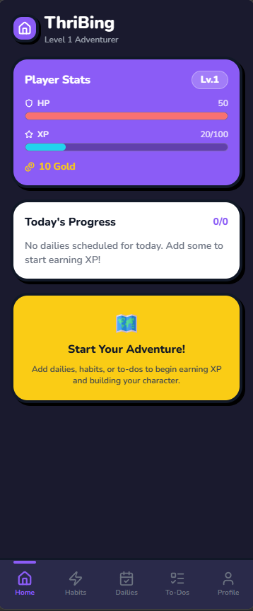
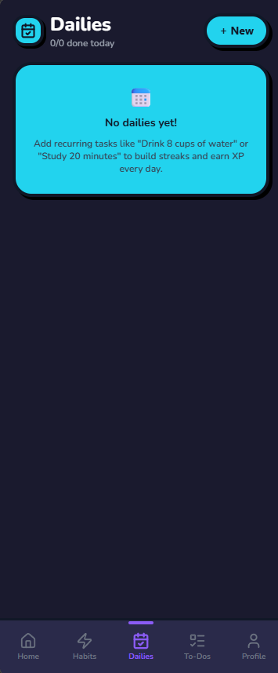
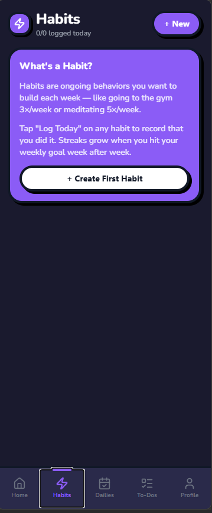
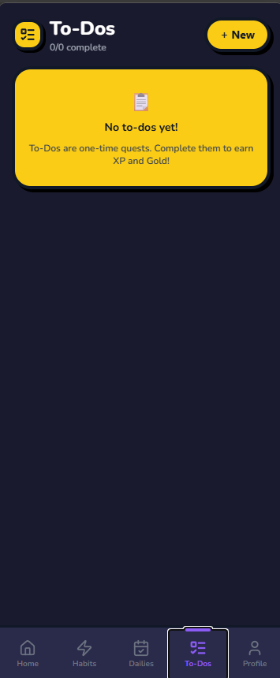
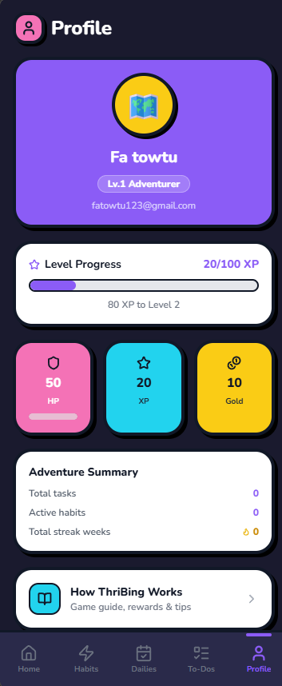

<div align="center">
  
  <h1>ThriBing</h1>
  <p><strong>A gamified habit & task tracker built with Expo + Firebase</strong></p>
  <p>Turn your daily goals into an RPG adventure. Level up, earn gold, pick a class, and build streaks — one habit at a time.</p>
</div>

---

## Screenshots

<div align="center">
  <table>
    <tr>
      <td align="center">
        <br/>
        <sub><b>Home Dashboard</b></sub>
      </td>
      <td align="center">
        <br/>
        <sub><b>Dailies</b></sub>
      </td>
      <td align="center">
        <br/>
        <sub><b>Habits</b></sub>
      </td>
      <td align="center">
        <br/>
        <sub><b>To-Dos</b></sub>
      </td>
      <td align="center">
        <br/>
        <sub><b>Profile</b></sub>
      </td>
    </tr>
  </table>
</div>

---

## Features

### Dailies — Quantity Tracking
- Set daily goals with targets: *Drink 8 cups of water*, *Run 10 km*, *Study 20 minutes*
- Tap **+** to log progress, watch the progress bar fill
- Enable a **countdown timer** for timed goals like studying
- Set a scheduled time badge (e.g. 7:00 AM)
- Auto-completes and awards XP + Gold when you hit the target
- Resets every midnight — missing dailies deals HP damage

### Habits — Weekly Goals & Streaks
- Set how many times per week you want to do something (*Gym 3×/week*)
- Tap to log each completion — week dots show which days you did it
- Build **weekly streaks** — hit your goal every week to keep the fire going 🔥
- Each log earns XP and Gold based on difficulty

### To-Dos — One-Time Quests
- One-time tasks that earn XP and Gold on completion
- Easy / Medium / Hard difficulty for bigger rewards

### RPG Progression

| Feature | Details |
|---------|---------|
| **HP** | Lose HP when dailies are missed at midnight |
| **XP** | Earned by completing tasks; fills your level bar |
| **Gold** | Earned alongside XP; spend it to change class |
| **Levels** | XP requirements scale each level |
| **Classes** | Unlock at Level 5: Swordsman, Wizard, Marksman, Healer, Rogue |

### Classes & Title Progressions
Pick your class at Level 5 (free). Change later for 50 Gold.

| Level | Swordsman | Wizard | Marksman | Healer | Rogue |
|-------|-----------|--------|----------|--------|-------|
| 5 | Squire | Apprentice | Scout | Acolyte | Pickpocket |
| 10 | Knight | Sorcerer | Sharpshooter | Cleric | Thief |
| 20 | Crusader | Warlock | Sniper | Priest | Assassin |
| 35 | Paladin | Archmage | Deadeye | Bishop | Phantom |
| 50 | Warlord | Grand Wizard | Gunslinger | Saint | Shadow Lord |

---

## Tech Stack

| Layer | Technology |
|-------|-----------|
| Framework | [Expo](https://expo.dev) (SDK 54) + [Expo Router](https://docs.expo.dev/router/introduction/) |
| Language | TypeScript |
| Styling | [NativeWind](https://www.nativewind.dev/) (Tailwind CSS for React Native) |
| Auth | Firebase Authentication (Email + Google) |
| Database | Cloud Firestore |
| State | [Zustand](https://zustand-demo.pmnd.rs/) |
| Icons | [Lucide React Native](https://lucide.dev/) |
| Fonts | Nunito (Google Fonts via Expo) |

---

## Getting Started

### Prerequisites
- Node.js 18+
- A Firebase project with Authentication and Firestore enabled

### Setup

```bash
# Clone the repo
git clone https://github.com/towtu/Thribing.git
cd Thribing

# Install dependencies
npm install

# Copy the example env and fill in your Firebase config
cp .env.example .env
```

Fill in `.env` with your Firebase project credentials:

```env
EXPO_PUBLIC_FIREBASE_API_KEY=
EXPO_PUBLIC_FIREBASE_AUTH_DOMAIN=
EXPO_PUBLIC_FIREBASE_PROJECT_ID=
EXPO_PUBLIC_FIREBASE_STORAGE_BUCKET=
EXPO_PUBLIC_FIREBASE_MESSAGING_SENDER_ID=
EXPO_PUBLIC_FIREBASE_APP_ID=
EXPO_PUBLIC_GOOGLE_WEB_CLIENT_ID=
```

### Run

```bash
# Start the dev server
npx expo start

# Web
npx expo start --web
```

Open on Android by scanning the QR code with the **Expo Go** app.

---

## Project Structure

```
app/
  (app)/
    (tabs)/          # Bottom tab screens
      index.tsx      # Home dashboard
      dailies.tsx    # Daily tasks
      habits.tsx     # Weekly habits
      todos.tsx      # One-time to-dos
      profile.tsx    # Profile & stats
    choose-class.tsx # Class selection screen
    tutorial.tsx     # How-to-play guide
  (auth)/
    login.tsx        # Login / sign-up
features/
  auth/              # Auth services, hooks, components
  tasks/             # Task CRUD, TaskCard, CreateTaskModal
  gamification/      # XP/Gold engine, class system
core_ui/
  components/        # CartoonCard, CartoonButton, ProgressBar, etc.
  theme.ts           # Colors, fonts, design tokens
lib/
  stores/            # Zustand stores (player, tasks)
  firebase.ts        # Firebase initialization
```

---

## License

MIT
